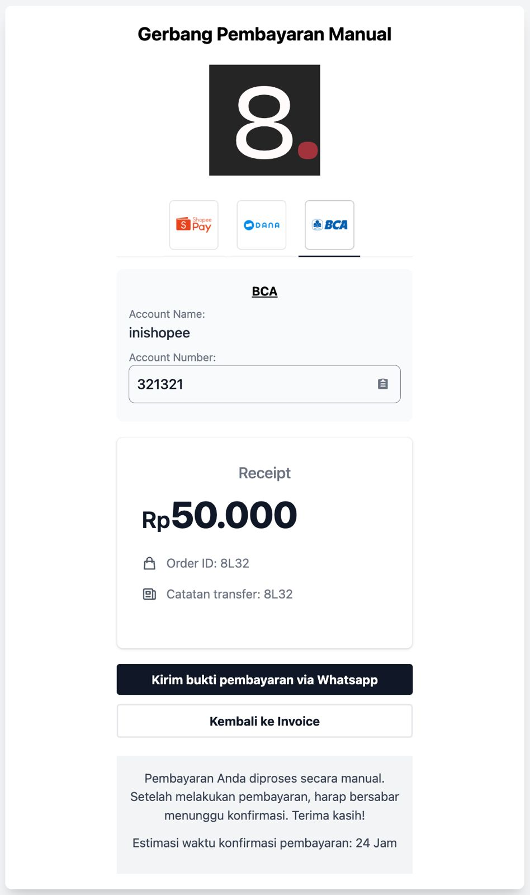

# GerbangPembayaranManual

GerbangPembayaranManual is a payment gateway extension for [Paymenter](https://github.com/Paymenter/paymenter) that enables clients to choose their preferred Indonesian bank or e-wallet for manual transfers and confirm payments via WhatsApp.



## Features

- **Support for Up to 3 Banks or E-Wallet Accounts**: Configure up to three different bank or e-wallet accounts to receive payments.
- **Click-to-WhatsApp**: Clients can easily confirm their payments by clicking a button that redirects them to WhatsApp chat with the seller.
- **IDR Currency Support**: Currently supports transactions in Indonesian Rupiah (IDR) only.
- **Indonesian Banks and E-Wallets**: Compatible with major Indonesian banks and e-wallet services.

## How It Works

1. **Select Payment Method**: Clients choose from the list of available banks or e-wallets during checkout.
2. **Manual Transfer**: Clients manually transfer the payment amount using their selected bank or e-wallet.
3. **Confirm via WhatsApp**: After transferring, clients click a button to confirm the payment through WhatsApp messaging with the seller.

## Installation

### Option 1: Install via Extension Marketplace

1. **Access the Extension Marketplace**:

   - Log in to your Paymenter admin panel.
   - Navigate to **Extensions**.

2. **Find and Install GerbangPembayaranManual**:

   - Search for **GerbangPembayaranManual**.
   - Click **Install**.

3. **Activate the Extension**:

   - Go to `https://your-paymenter.com/admin/extensions`.
   - Find **GerbangPembayaranManual** and set **Enabled** to **True**.

### Option 2: Manual Installation via GitHub

1. **Download the Extension**:

   - Clone the repository or download the ZIP file:

     ```bash
     git clone https://github.com/yourusername/GerbangPembayaranManual.git
     ```

2. **Upload to Paymenter**:

   - Place the `GerbangPembayaranManual` folder into the `app/Extensions/Gateways` directory of your Paymenter installation.

3. **Activate the Extension**:

   - Log in to your Paymenter admin panel.
   - Navigate to `https://your-paymenter.com/admin/extensions`.
   - Find **GerbangPembayaranManual** and set **Enabled** to **True**.

## Configuration

After activating the extension, you need to configure it with your bank or e-wallet account details and other settings.

### Configuration Fields

Here are the fields that you need to fill in:

- **Order ID Prefix** (`order_id_prefix`):
  - *Type*: Text
  - *Placeholder*: Order ID Prefix
  - *Required*: No
  - *Description*: A prefix to be added to all order IDs.

- **Payment Confirmation ETA** (`payment_confirmation_eta`):
  - *Type*: Text
  - *Placeholder*: Estimate time for payment confirmation
  - *Required*: No
  - *Description*: Estimated time for confirming payments.

#### Payment Method 1

- **Payment 1: Bank or Wallet Name** (`bank_name_1`):
  - *Type*: Dropdown
  - *Required*: Yes
  - *Options*: List of supported banks or e-wallets.
  - *Description*: Name of the bank or e-wallet to accept payment.

- **Payment 1: Merchant or Account Name** (`merchant_name_1`):
  - *Type*: Text
  - *Required*: Yes
  - *Description*: Name of the merchant or account holder.

- **Payment 1: Bank or Wallet Account Number** (`bank_account_number_1`):
  - *Type*: Text
  - *Required*: Yes
  - *Description*: Account number of the bank or e-wallet to accept payment.

#### Payment Method 2 (Optional)

- **Payment 2: Bank or Wallet Name** (`bank_name_2`):
  - *Type*: Dropdown
  - *Required*: No
  - *Options*: List of supported banks or e-wallets.
  - *Description*: Name of the bank or e-wallet to accept payment.

- **Payment 2: Merchant or Account Name** (`merchant_name_2`):
  - *Type*: Text
  - *Required*: No
  - *Description*: Name of the merchant or account holder.

- **Payment 2: Bank or Wallet Account Number** (`bank_account_number_2`):
  - *Type*: Text
  - *Required*: No
  - *Description*: Account number of the bank or e-wallet to accept payment.

#### Payment Method 3 (Optional)

- **Payment 3: Bank or Wallet Name** (`bank_name_3`):
  - *Type*: Dropdown
  - *Required*: No
  - *Options*: List of supported banks or e-wallets.
  - *Description*: Name of the bank or e-wallet to accept payment.

- **Payment 3: Merchant or Account Name** (`merchant_name_3`):
  - *Type*: Text
  - *Required*: No
  - *Description*: Name of the merchant or account holder.

- **Payment 3: Bank or Wallet Account Number** (`bank_account_number_3`):
  - *Type*: Text
  - *Required*: No
  - *Description*: Account number of the bank or e-wallet to accept payment.

#### WhatsApp Configuration

- **WhatsApp Number** (`whatsapp_number`):
  - *Type*: Text
  - *Placeholder*: WhatsApp Number for Sending Confirmation (format 628xxxxxxxxx)
  - *Required*: Yes
  - *Description*: Your WhatsApp number in the format `628xxxxxxxxx`.

- **Confirmation Message** (`confirmation_message`):
  - *Type*: Text
  - *Placeholder*: e.g., "Halo Admin, berikut bukti pembayaran sewa cloud"
  - *Required*: Yes
  - *Description*: The message that customers will send via WhatsApp to confirm their payment.

### Steps to Configure

1. **Navigate to the Extension Settings**:

   - In the Paymenter admin panel, go to **Settings** > **Payment Gateways**.
   - Click on **GerbangPembayaranManual**.

2. **Fill in the Required Fields**:

   - Enter the **Order ID Prefix** (optional).
   - Set the **Payment Confirmation ETA** (optional).

3. **Configure Payment Methods**:

   - For **Payment 1**, select the **Bank or Wallet Name** from the dropdown, and fill in the **Merchant Name** and **Account Number**.
   - Optionally, repeat the above step for **Payment 2** and **Payment 3**.

4. **Set Up WhatsApp Details**:

   - Enter your **WhatsApp Number** in the format `628xxxxxxxxx`.
   - Define the **Confirmation Message** that customers will send.

5. **Save the Settings**.

## Usage

- **For Clients**:

  1. During checkout, select **GerbangPembayaranManual** as the payment method.
  2. Choose your preferred bank or e-wallet from the available options.
  3. Transfer the payment amount manually using the provided account details.
  4. Click the **Confirm via WhatsApp** button to send the predefined message and confirm the payment.

- **For Sellers**:

  - Ensure your WhatsApp contact information is correctly configured.
  - Monitor WhatsApp for payment confirmations from clients.
  - Verify the payment and process the order accordingly.

## Requirements

- **Paymenter**: Ensure you have Paymenter installed and properly configured.
- **WhatsApp**: Clients need WhatsApp installed on their device to confirm payments.
- **Indonesian Bank/E-Wallet Accounts**: Only Indonesian financial institutions are supported.

## Screenshot

Below is a screenshot of the GerbangPembayaranManual extension in action:


## Contributing

Contributions are welcome! Please follow these steps:

1. Fork the repository.
2. Create a new branch: `git checkout -b feature/YourFeature`.
3. Commit your changes: `git commit -m 'Add some feature'`.
4. Push to the branch: `git push origin feature/YourFeature`.
5. Open a pull request.

## License

This project is licensed under the [MIT License](LICENSE).